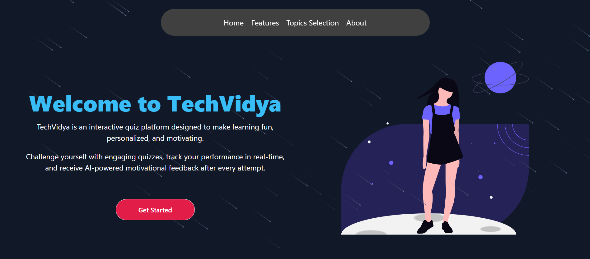
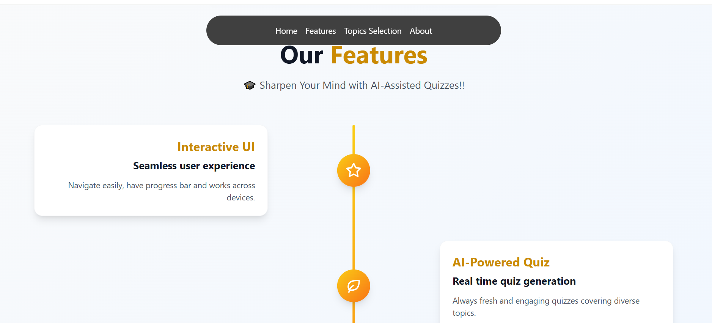
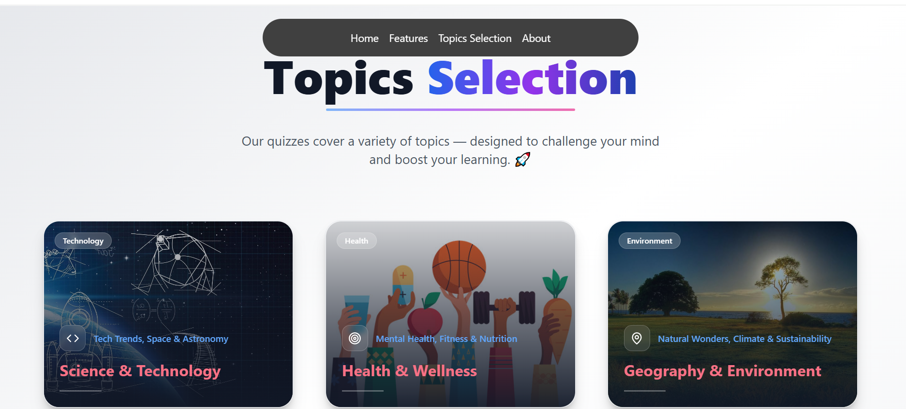
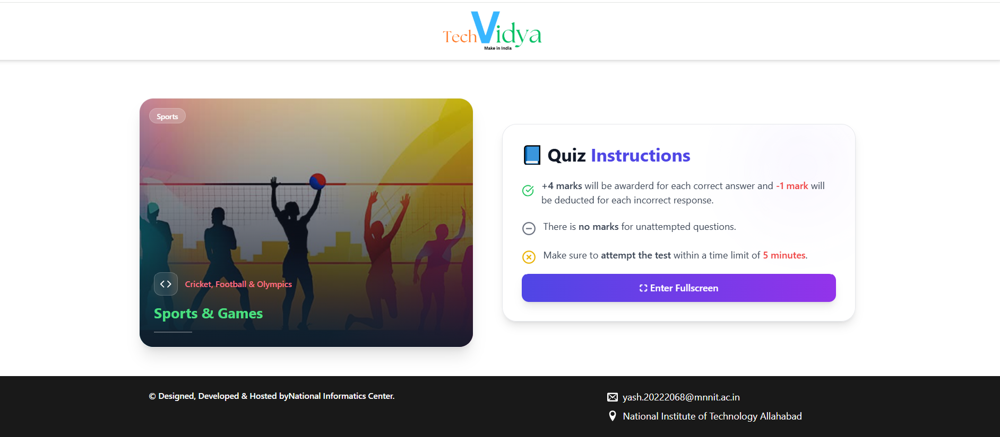
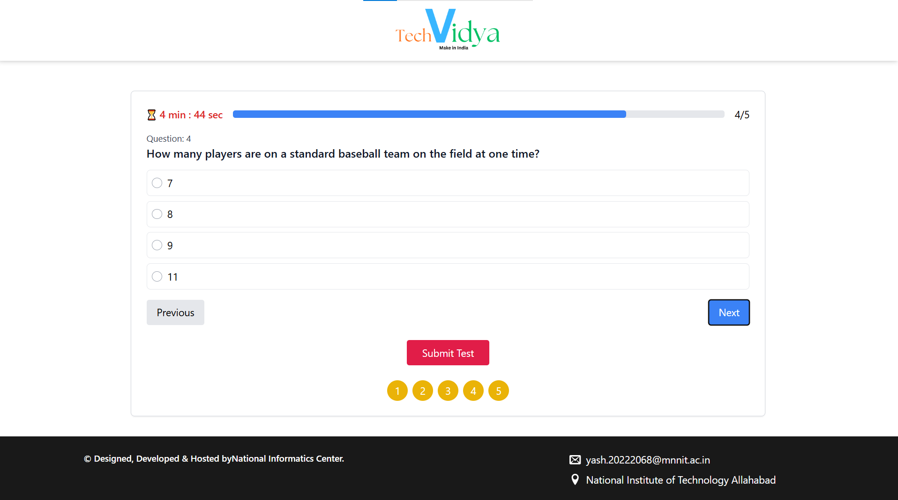
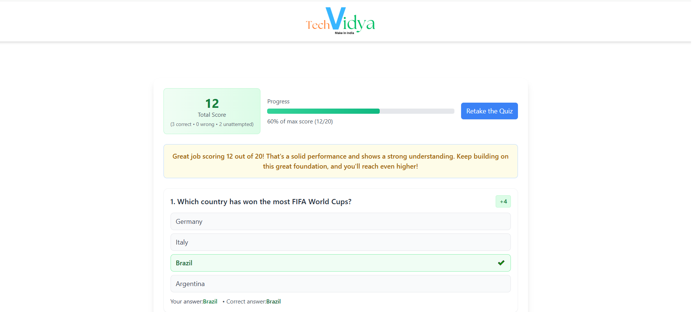

# 🧠 Tech Vidya - an AI-Assisted Knowledge Quiz  

An intelligent and interactive quiz platform powered by **AI** — designed to make learning fun and dynamic. Built using **React.js**, **Tailwind CSS**, and **Framer Motion**.  

---

## Features

### 1. Interactive UI 🖥️✨
- Smooth, intuitive interface with a progress bar for easy navigation.
- Fully responsive, delivering a seamless experience across all devices.

### 2. AI-Powered Quiz 🤖📝
- Generates fresh quizzes in real-time covering diverse topics.
- Adaptive difficulty ensures an engaging challenge for every user.

### 3. Smart Results 📊💡
- Personalized feedback with a detailed result breakdown.
- Motivational messages to encourage learning and improvement.

### 4. Persistent Progress 💾🔄
- Saves quiz data automatically to prevent loss on refresh.
- Provides a reliable and continuous quiz experience across sessions.

---

## Demo Video & Live Hosting

- **🎥 Video Demo:** [Watch Here](https://drive.google.com/file/d/1eVuNXHqkMUugiK0iO3mnkT5A_EU6FOsU/view?usp=sharing)  
- **🌐 Live App:** [Try it Live](https://techvidya-meta.vercel.app)
  
---
  
## ⚙️ Architecture Overview  

| Component | Description |
|------------|-------------|
| **External API** | Fetches real-time quiz questions dynamically from AI |
| **CategoryData.js** | Stores category titles, icons, and images |
| **QuizTopics.js** | Displays clickable topic cards |
| **Instructions.js** | Shows exam rules and handles fullscreen entry |
| **TestWindow.js** | Displays questions and manages answers |
| **Result.js** | Calculates and displays quiz performance |
| **LocalStorage** | Persists quiz data across sessions |
| **Framer Motion** | Adds smooth animations and transitions |

---

## 🧰 Tech Stack  

| Tool | Purpose |
|------|----------|
| **React.js** | Frontend framework |
| **Tailwind CSS** | Styling & responsive layout |
| **Framer Motion** | Animations |
| **Lucide React** | Modern vector icons |
| **React Router DOM** | Navigation |
| **LocalStorage API** | Persistent quiz data |

---

## 🖼️ Screenshots  

| Page | Description |
|------|--------------|
| 🏠 **Home** | Animated banner and introduction |
| 🧭 **Topic Selection** | Interactive cards for each quiz category |
| 📋 **Instructions** | Displays quiz rules and name input |
| 🧑‍💻 **Test Window** | Question interface with navigation |
| 📊 **Result** | Final score and answer summary |

> *(Screenshots for better visualization)*

---

## 🧪 Future Improvements  

- 👥 Add **user login and leaderboard**  
- 💾 Integrate **backend for data storage**  
- 🌙 Support **dark mode**

---

## 🧑‍💻 Author  

**Developed by:**  
**Yash Pandey**  
🎓 *National Institute of Technology, Allahabad (MNNIT)*  

📧 Email: [yash.20222068@mnnit.ac.in](mailto:yash.20222068@mnnit.ac.in)  
🏢 Designed, Developed & Hosted by: **National Informatics Centre (NIC)**  

---

## 🌟 Acknowledgements  
 
- **Lucide Icons** – For modern vector icons  
- **Framer Motion** – For elegant animations  
- **TailwindCSS** – For styling simplicity  

---

⭐ **If you like this project, please give it a star!** 🌟
