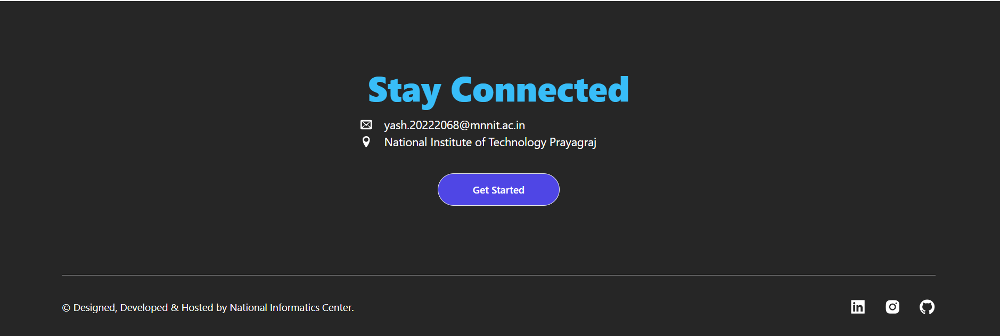

# 🧠 Tech Vidya - an AI-Assisted Knowledge Quiz  

An intelligent and interactive quiz platform powered by **AI** — designed to make learning fun and dynamic. Built using **React.js**, **Tailwind CSS**, and **Framer Motion**.  

---
## 🧠 Problem Understanding

The goal of **Tech Vidya** is to simplify online assessments through **automation and intelligent evaluation**. It provides students with a smooth testing experience and teachers with instant **AI-driven insights**.

---

## Features

### 1. Interactive UI 🖥️✨
- Smooth, intuitive interface with a progress bar for easy navigation.
- Fully responsive, delivering a seamless experience across all devices.

### 2. AI-Powered Quiz 🤖📝
- Generates fresh quizzes in real-time covering diverse topics.
- Adaptive difficulty ensures an engaging challenge for every user.

### 3. Smart Results 📊💡
- Personalized feedback with a detailed result breakdown.
- Motivational messages to encourage learning and improvement.

### 4. Persistent Progress 💾🔄
- Saves quiz data automatically to prevent loss on refresh.
- Provides a reliable and continuous quiz experience across sessions.

---

## Demo Video & Live Hosting

- **🎥 Video Demo:** [Watch Here](https://drive.google.com/file/d/1eVuNXHqkMUugiK0iO3mnkT5A_EU6FOsU/view?usp=sharing)  
- **🌐 Live App:** [Try it Live](https://techvidya-meta.vercel.app)
  
---
  
## ⚙️ Architecture Overview  
```bash
Tech Vidya/
├── public/ # Contain main index.html
└── src/
├── Assets/ # Application-specific assets (logos, media, etc.)
├── Components/ # Reusable React components
│ ├── Analysis/ # Components for test result
│ ├── Home/ # Homepage UI components
│ ├── StartTest/ # Components for test initiation
│ ├── TestWindow/ # Test-taking window UI
│ ├── Footer.js # Global footer component
│ └── Header.js # Global header component
│
├── ExternalAPI/ # API integration logic
│ └── AiService.js # Handles AI-based API calls
│
├── Helpers/ # Contain some additional files
│
├── Pages/ # Page-level React components (main views)
│ ├── Analysis.jsx
│ ├── Home.jsx
│ ├── StartTest.jsx
│ └── TestWindow.jsx
│
├── App.jsx # Root component
├── index.css # Global CSS styles
├── index.js # React entry point
└── utils.js # Global utility functions
├── .env # Environment variables (API keys, endpoints)
├── .gitignore # Ignored files for Git
```

---

## 🧰 Tech Stack  

| Tool | Purpose |
|------|----------|
| **React.js** | Frontend framework |
| **Tailwind CSS** | Styling & responsive layout |
| **Framer Motion** | Animations |
| **Lucide React** | Modern vector icons |
| **React Router DOM** | Navigation |
| **LocalStorage API** | Persistent quiz data |

---

## 🖼️ Screenshots  

| Page | Description |
|------|--------------|
| 🏠 **Home** | Animated banner and introduction |
| 🧭 **Topic Selection** | Interactive cards for each quiz category |
| 📋 **Instructions** | Displays quiz rules and name input |
| 🧑‍💻 **Test Window** | Question interface with navigation |
| 📊 **Result** | Final score and answer summary |

> *(Screenshots for better visualization)*




---

## 🧪 Future Improvements  

- 👥 Add **user login and leaderboard**  
- 💾 Integrate **backend for data storage**  
- 🌙 Support **dark mode**

---
## 🛠️ Installation Guide

Follow these steps to set up and run the project locally:

### 1. Clone the repository
```bash
git clone https://github.com/yash264/TechVidya.git
cd TechVidya
npm i
npm start
```

## 🧑‍💻 Author  

**Developed by:**  
**Yash Pandey**  
🎓 *National Institute of Technology, Allahabad (MNNIT)*  

📧 Email: [yash.20222068@mnnit.ac.in](mailto:yash.20222068@mnnit.ac.in)  
🏢 Designed, Developed & Hosted by: **National Informatics Centre (NIC)**  

---

## 🌟 Acknowledgements  
 
- **Lucide Icons** – For modern vector icons  
- **Framer Motion** – For elegant animations  
- **TailwindCSS** – For styling simplicity  

---

⭐ **If you like this project, please give it a star!** 🌟
